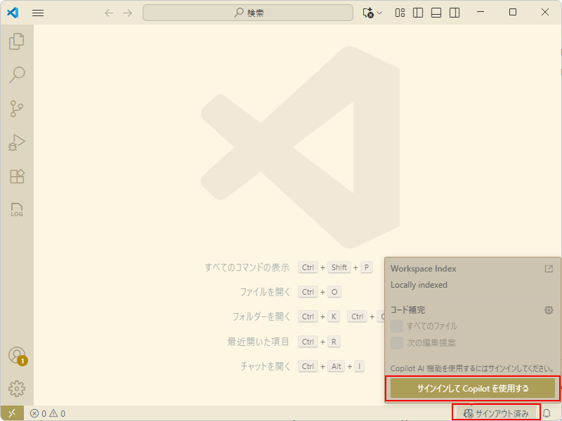
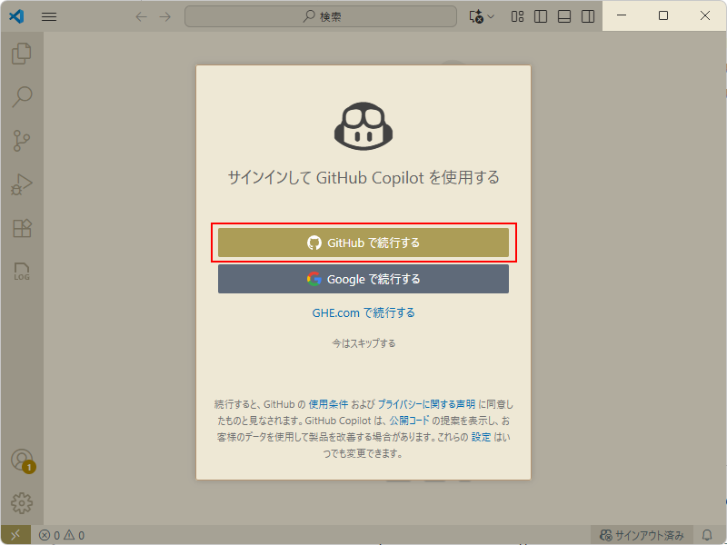

# 開発環境の構築

#### ⏳ 推定時間

- 40 ~ 60分


#### 🗒️ 目次

1. [WSL インストール](#wslインストール)
1. [WSL(Ubuntu) に ツールインストール](#wsl-ubuntu-にツールインストール)
1. [Visual Studio Code インストール](#visual-studio-code-インストール)
1. [Visual Studio Code の設定](#visual-studio-code-の設定)

> [!IMPORTANT]  
> 本手順は **Windows 環境** を前提としています。
> 他の環境(macOS, Linux)は読み替えて準備をしてください。
> なお、ローカル環境 か 仮想環境 か については問いません。

> [!IMPORTANT]  
> 開発環境はWSLを利用するため「仮想化が有効」な環境が必要です。
> Azure VM を利用する場合、docsを確認の上、機能サポートとして **「入れ子になった仮想化」がサポートされたシリーズ** を利用します。
> 
> 例:
> - [Dsv4 シリーズ](https://learn.microsoft.com/ja-jp/azure/virtual-machines/sizes/general-purpose/dsv4-series)
>     - Standard_D4s_v4
>     - Standard_D8s_v4
> - [Dsv5 シリーズ](https://learn.microsoft.com/ja-jp/azure/virtual-machines/sizes/general-purpose/dsv5-series)
>     - Standard_D4s_v5
>     - Standard_D8s_v5


## WSLインストール

1. PowerShell を管理者で起動

1. WSLに必要なオプション機能を有効化

    ```
    # Linux 用 Windows サブシステムを有効化
    dism.exe /online /enable-feature /featurename:Microsoft-Windows-Subsystem-Linux /all /norestart
    ```
    ```
    # 仮想マシン機能を有効化
    dism.exe /online /enable-feature /featurename:VirtualMachinePlatform /all /norestart
    ```

1. PC または VM (ご自身の開発環境) を再起動

1. PowerShell を管理者で起動

1. WSLインストール

    ```
    wsl --update
    wsl --install --distribution ubuntu
    ```

1. ウィザードに従って新規ユーザーを作成

    - user account: (任意名で作成)
    - password: (任意のパスワードを設定)

1. 自動的にUbuntuへログイン


<details>
<summary>(*) 参考情報: WSLコマンド</summary>

- WSLでインストールされたディストリビューションおよび状態の一覧

    ```
    wsl --list --verbose
    ```

- 指定のディストリビューションを起動してログイン

    ```
    wsl --distribution <DISTRIBUTION_NAME> --user <USER_NAME>
    ```

    例： `root` ユーザーでデフォルトディストリビューションの `~` ユーザーディレクトリへログイン

    ```
    wsl --user root --cd ~
    ```

</details>

<details>
<summary>(*) 参考情報: リンク</summary>

- [以前のバージョンの WSL の手動インストール手順](https://learn.microsoft.com/ja-jp/windows/wsl/install-manual)
- [WSL を使用して Windows に Linux をインストールする方法](https://learn.microsoft.com/ja-jp/windows/wsl/install)
</details>

## WSL (Ubuntu) にツールインストール

### Docker (Linux版) インストール

1. PowerShell を立ち上げて、WSL (Ubuntu) にログイン

    > [!TIP]  
    > 前の手順の続きで実施する場合、すでに Ubuntu へログイン済みなので
    > 改めてのログインはスキップできます。

    ```
    wsl ~
    ```

1. `apt` 更新

    > [!NOTE]  
    > コマンドはまとめて実行すると正しく動作しない場合があります。
    > うまくインストールできない場合、一行ずつ実行してみます。

    ```
    # Add Docker's official GPG key:
    sudo apt-get update
    sudo apt-get install ca-certificates curl
    sudo install -m 0755 -d /etc/apt/keyrings
    sudo curl -fsSL https://download.docker.com/linux/ubuntu/gpg -o /etc/apt/keyrings/docker.asc
    sudo chmod a+r /etc/apt/keyrings/docker.asc

    # Add the repository to Apt sources:
    echo \
    "deb [arch=$(dpkg --print-architecture) signed-by=/etc/apt/keyrings/docker.asc] https://download.docker.com/linux/ubuntu \
    $(. /etc/os-release && echo "${UBUNTU_CODENAME:-$VERSION_CODENAME}") stable" | \
    sudo tee /etc/apt/sources.list.d/docker.list > /dev/null
    sudo apt-get update
    ```

1. Dockerパッケージをインストール

    ```
    sudo apt-get install -y \
        docker-ce \
        docker-ce-cli \
        containerd.io \
        docker-buildx-plugin \
        docker-compose-plugin
    ```

1. `sudo`なしで実行できるよう設定

    ```
    sudo groupadd docker
    sudo gpasswd -a $USER docker
    sudo systemctl restart docker
    ```

1. 起動中のUbuntuを再起動

    いったん Ubuntu から抜ける

    ```
    exit
    ```

    PowerShell にて、起動中の Ubuntu を止めて、再起動、ログイン

    ```
    wsl --shutdown
    wsl ~
    ```

1. 動作確認

    テストコンテナの起動

    ```
    docker run hello-world
    ```

    不要イメージ、コンテナの削除

    ```
    docker system prune -af
    ```

(*) 参考: リンク

- [Install Docker Engine on Ubuntu](https://docs.docker.com/engine/install/ubuntu/)


### Node.js インストール

1. WSL (Ubuntu) に入っていなければログイン

    ```
    wsl ~
    ```

1. Node.js をインストール

    ```
    sudo apt update
    sudo apt install -y nodejs npm
    ```

1. 動作確認

    ```
    npm --version
    ```

### az cli インストール

1. WSL (Ubuntu) に入っていなければログイン

    ```
    wsl ~
    ```

1. az cli をインストール

    ```
    sudo curl -sL https://aka.ms/InstallAzureCLIDeb | sudo bash
    ```

1. 動作確認

    ```
    az --version
    ```

### gh コマンド インストール

1. WSL (Ubuntu) に入っていなければログイン

    ```
    wsl ~
    ```

1. gh コマンドをインストール

    ```
    (type -p wget >/dev/null || (sudo apt update && sudo apt install wget -y)) \
        && sudo mkdir -p -m 755 /etc/apt/keyrings \
        && out=$(mktemp) && wget -nv -O$out https://cli.github.com/packages/githubcli-archive-keyring.gpg \
        && cat $out | sudo tee /etc/apt/keyrings/githubcli-archive-keyring.gpg > /dev/null \
        && sudo chmod go+r /etc/apt/keyrings/githubcli-archive-keyring.gpg \
        && sudo mkdir -p -m 755 /etc/apt/sources.list.d \
        && echo "deb [arch=$(dpkg --print-architecture) signed-by=/etc/apt/keyrings/githubcli-archive-keyring.gpg] https://cli.github.com/packages stable main" | sudo tee /etc/apt/sources.list.d/github-cli.list > /dev/null \
        && sudo apt update \
        && sudo apt install gh -y
    ```

1. 動作確認

    ```
    git --version
    gh --version
    ```


## Visual Studio Code インストール

1. 以下のページへアクセス

    https://code.visualstudio.com/download

1. 環境にあわせたインストーラーをダウンロード

1. インストール


## Visual Studio Code の設定

### GitHub Copilot の設定

1. 画面右下のCopilotアイコンを開き「Copilotの設定」を選択

    

1. 「GitHubで続行する」を選択し、Copilotのライセンスがあるアカウントで GitHub へログイン

    


### Visual Studio Code 拡張機能の追加

1. 以下の拡張機能を追加

    - [WSL](https://marketplace.visualstudio.com/items?itemName=ms-vscode-remote.remote-wsl)
    - [GitHub Actions](https://marketplace.visualstudio.com/items?itemName=github.vscode-github-actions)


