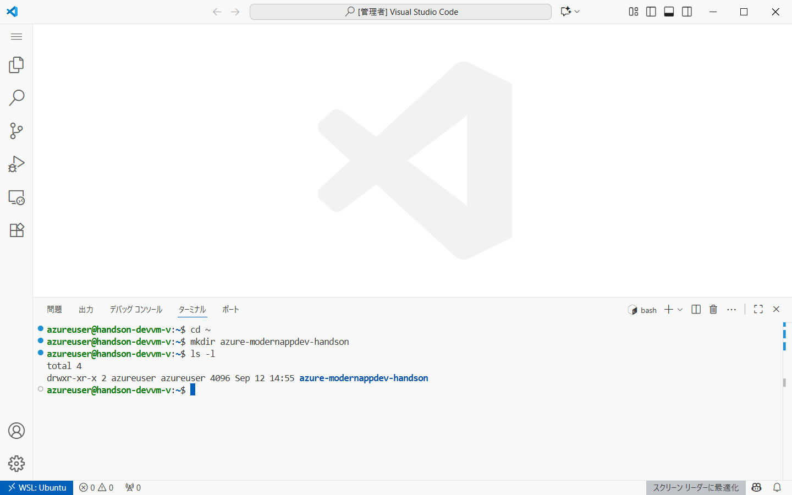

# Ex01: GitHub Copilot を使った アプリ開発

#### ⏳ 推定時間

- 10 ~ 15分

#### 💡 学習概要

GitHub Copilot を用いて「電卓Webアプリ」を作成します。
このアプリ作成を通して GitHub Copilot を用いた開発支援の使い方について学びます。

#### 🗒️ 目次

1. [プロジェクトフォルダ作成](#プロジェクトフォルダ作成)
1. [アプリのひな型を実装](#アプリのひな型を実装)
1. [アプリの修正](#アプリの修正)
1. [単体テストの追加](#単体テストの追加)
1. [コンテナ化](#コンテナ化)


## プロジェクトフォルダ作成

1. Visual Studio Code を起動、左下「リモートウィンドウを開く」を選択し、「WSLへの接続」を実行

    

1. [表示]-[ターミナル] を開く

    

1. 統合ターミナルを使ってプロジェクト用フォルダ作成

    ```
    cd ~
    mkdir azure-modernappdev-handson
    ```

    

1. 「エクスプローラー」から「フォルダーを開く」を選択

    

1. 作成したフォルダを選択して「OK」

    

1. 初回起動の場合、フォルダを信頼するかどうか、の確認が表示されるので、「はい、作成者を信頼します」

    


## アプリのひな型を実装

1. GitHub Copilot アイコンを選択して、 GitHub Copilot チャット画面を表示

    

1. Agentモードになっていることを確認して、以下を指示

    ```
    電卓アプリを作成。
    Web上のUIで基本的な四則演算が可能。
    Node.js + Express を利用。view engine には ejs を利用。
    WebUIはできるだけシンプルにして、実際の処理はサーバーで実施。
    サーバーは四則演算可能なAPIを用意。
    アプリはポート3000番で受付。
    ソースは /src 以下に配置。
    package.json に実行コマンドを準備。
    データベースは利用しない。
    ```

    

1. 出来上がったコードを「保持」、ターミナルコマンド（`npm install`）を「続行」

    何かしらエラーが発生した場合、修正を指示してコマンドが正常終了するよう繰り返す。

    

1. アプリ実行を指示

    ```
    アプリを実行して
    ```

    

1. 生成されたターミナルコマンド（`npm start`）を「続行」

1. ブラウザを起動して動作確認

    


## アプリの修正

1. アプリ修正を指示

    以下は修正指示の例です。任意の修正を試します。

    ```
    UIを次のように修正
    - 0-9の数字、少数、四則演算、計算実行するための "=" ボタンなど追加
    - 選択した数字や計算結果を表示する窓を追加
    ```

    ```
    UIにBootstrapを適用して
    ```

    ```
    UI上で計算履歴が確認できるよう修正して。
    計算履歴は電卓の右側に準備。
    最大10個まで記憶。
    ```

1. コード修正されたら「保持」を行い、ブラウザを更新して動作確認

    

## 単体テストの追加

四則演算を行うAPIの単体テストを行います。
今回は演算処理を切り出して、切り出した関数群をテストします。

「アプリ開発」から「手エスト」にコンテキストが変化するため、**新規チャットで実施**します。

まずはリファクタしていきます。

1. 単体テストしやすいようリファクタを指示

    `/src/app.js` など計算処理が書かれたファイルをコンテキストに追加して以下を指示します。

    ```
    #file:app.js
    次の場所に API で計算する処理の実態を移動
    /src/controllers
    ```

    

1. コード修正されたら「保持」を行い、ブラウザを更新して動作確認

    

単体テストフレームワークを組み込みます。

1. 単体テストフレームワークを組み込み

    関数ファイルは適宜読み替えます。
    関数ファイルをコンテキストに追加して以下の指示を行います。

    ```
    JavaScriptの単体テストコードを作成。
    テストフレームワークはJestを使用。
    テスト対象の関数は /src/controllers/calcController.js に定義された関数すべて。
    テストコードは /tests 以下に配置。
    テスト実行するためのスクリプトも追加。
    ```
    

1. コード修正されたら「保持」を行い、提示されたコマンドを「続行」

    

1. テスト実行を指示して確認

    ```
    単体テストを実行して
    ```
    

    実行結果の確認

    

テストケースを拡充します。

1. テストケースを拡充するよう指示
    
    `/tests/calcController.test.js` を開き、チャット欄にてファイル名を選択（＝コンテキストに追加）

    ```
    正常系と異常系（特殊記号など）が含まれるようテストケースを追加して
    ```
    

1. コード修正されたら「保持」を行い、提示されたコマンド（テスト再実行）を「続行」

    


## コンテナ化

「テスト」から「コンテナ化」へコンテキストが変わるため、**新規チャットで開始**します。

1. コンテナ化するよう指示

    ```
    コンテナ化して
    不要なファイル（テストファイルやnode_modulesなど）は可能な限り含めない
    アプリのコードは /src 以下にあるものを利用
    リビルドする際に再ビルド範囲が少なくなるよう実装して
    ```

    

    エラーが発生する場合があるので、都度、Copilotの応答を確認しながら指示で修正していきます。
    問題がなくなれば「保持」して確定します。

    

1. コンテナ起動するよう指示

    ```
    作成したコンテナを起動して
    ```

    

1. ブラウザを開いて動作確認

    

    

1. 実行中コンテナの停止を指示

    ```
    実行中コンテナを止めて
    ```

    

<!-- 
## 参考

```
Web上で利用可能な電卓アプリを作成。

# 機能
Web上のUIで基本的な四則演算が可能。
UIには0-9の数字、四則演算、計算実行するための "=" ボタンなどがある。

# フレームワーク、ライブラリ
Node.js + Express を利用。
view engine には ejs を利用。

# ディレクトリ構成
ソースは /src 以下に配置。

# データベース
データベースは利用しない。

# アーキテクチャ
WebUIはできるだけシンプルにして、実際の処理はサーバーで実施。
サーバーは四則演算可能なAPIを用意。

# ビルド実行方法
package.json にある実行コマンドから起動可能。
```

    - プログラミング言語
    - フレームワーク、ライブラリ、ツール
    - ディレクトリ構成
    - 初期ファイルの内容や構成
    - データベース
    - アーキテクチャ
    - ビルドや実行方法
    - テストの方針
    - CI/CDの設定
    - Docker対応の有無 …など    
 -->
