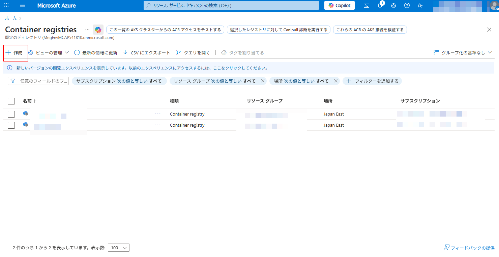
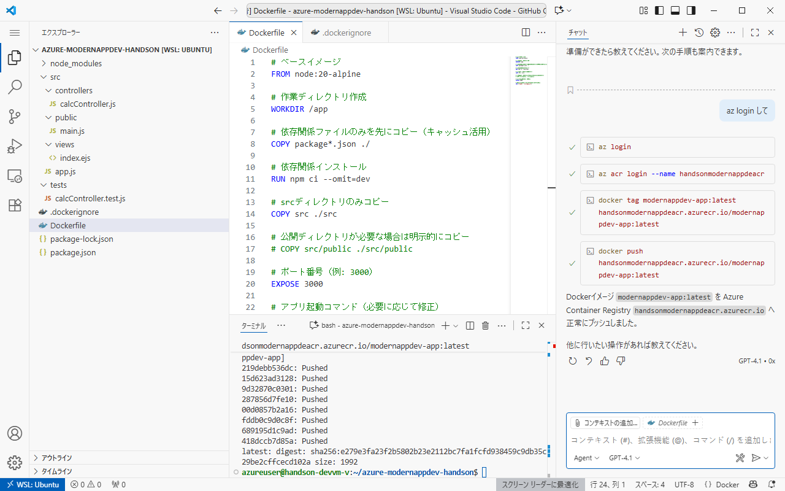
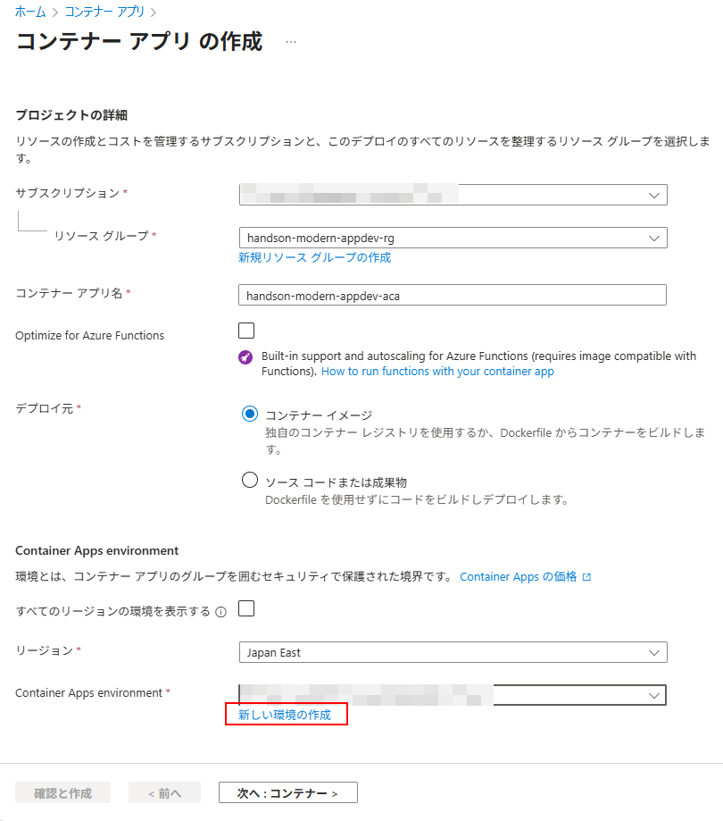
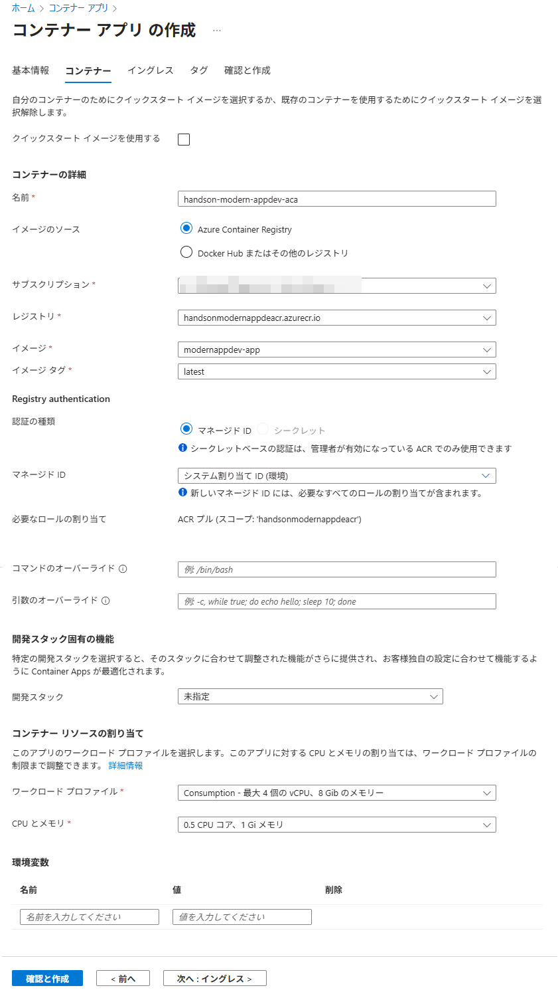

# Ex02: Azure上にコンテナ実行環境構築

#### ⏳ 推定時間

- 10 ~ 15分


#### 💡 学習概要

作成したWebアプリケーションをAzure上の Azure Container Apps へデプロイしていきます。
ここではデプロイ先インフラ環境を構築し、アプリケーションが実際に動作するまでの一連作業を学びます。


#### 🗒️ 目次

1. [リソースグループ作成](#リソースグループ作成)
1. [コンテナレジストリ作成](#コンテナレジストリ作成)
1. [コンテナレジストリに対する権限設定](#コンテナレジストリに対する権限設定)
1. [作成済みイメージのプッシュ](#作成済みイメージをコンテナレジストリにプッシュ)
1. [コンテナアプリ作成](#コンテナアプリ作成)
1. [動作確認](#動作確認)


## リソースグループ作成

1. Azureポータルを開き、上段検索窓で「リソースグループ」を検索して開く

1. 「作成」を選択

1. リソースグループの作成

    1. 基本情報

        - サブスクリプション: (ハンズオン用のもの)
        - リソースグループ名: (任意)
        - リージョン: `Japan East`
    
        

    1. タグ

        （なし）

    1. レビューと作成

        内容を確認して「作成」

        


## コンテナレジストリ作成

1. Azureポータルを開き、上段検索窓で「container registries」を検索して開く

    

1. 「作成」を選択

    

1. コンテナー レジストリの作成

    1. 基本

        - サブスクリプション: (ハンズオン用のもの)
        - リソースグループ名: (作成済みのもの)
        - レジストリ名: (任意。英数字のみ。5-50文字。)
        - 場所: `Japan East`
        - ドメイン名ラベルのスコープ: `セキュリティ保護なし`
        - 可用性ゾーンを使用する: `チェックなし`
        - 価格プラン: `Basic`
        - ロールの割り当てアクセス許可モード: `RBACレジストリ の アクセス許可`

        

    1. ネットワーク ~ タグ

        (デフォルト まま)

    1. 確認と作成

        内容を確認して「作成」

        


## コンテナレジストリに対する権限設定

1. Azureポータルにて、作成したコンテナレジストリを開く

1. [アクセス制御(IAM)] を開き、「ロールの割り当ての追加」を開く

    

1. ロールの割り当ての追加

    1. ロール

        - 職務ロール: `AcrPush`

        

    1. メンバー

        - アクセスの割当先: `ユーザー、グループ、またはサービス プリンシパル`
        - メンバー: (自分自身)

        

    1. レビューと割り当て

        内容を確認して「レビューと割り当て」

        


## 作成済みイメージをコンテナレジストリにプッシュ

開発環境から Dockerイメージ を ACR へプッシュ

コンテキストが変わるので**新規チャットで開始**します。

1. 開発環境の Visual Studio Code で Copilot の Agent モード を起動

1. 作成済みイメージを確認

    ```
    作成済みのDockerイメージを確認して
    ```

    

    

1. 作成したイメージをコンテナレジストリにプッシュ

    `<IMAGE_NAME>` は前述のコマンドで取得されたイメージ名(`REPOSITORY`)を利用します。
    `<ACR_SERVER_NAME>` は作成した Azure Container Registry の「概要」にある「ログイン サーバー」を利用します。

    ```
    作成済み Dockerイメージ `<IMAGE_NAME>` を
    Azure Container Registry `<ACR_SERVER_NAME>` へ
    azコマンドを使ってプッシュ
    ```

    

    > [!NOTE]  
    > 基本的なプッシュの流れは以下の手順です。
    > いきなり正しいコマンドを生成するとは限りませんが、基本的な流れにそってコマンドが提案されるので、順次実行を行います。
    > うまく実行されない場合、修正指示を行って是正しながら進めます。
    > 
    > 1. Azure CLI でログイン
    > 
    >     ```
    >     az login --use-device
    >     ```
    > 
    > 1. レジストリへログイン
    > 
    >     ```
    >     az acr login --name <ACR_SERVER_NAME>
    >     ```
    > 
    > 1. イメージにタグ付け
    > 
    >     ```
    >     docker tag <IMAGE_NAME> <ACR_SERVER_NAME>/<IMAGE_NAME>:latest
    >     ```
    > 
    > 1. プッシュ
    > 
    >     ```
    >     docker push <ACR_SERVER_NAME>/<IMAGE_NAME>:latest
    >     ```

    

Azureポータルにてプッシュされた Dockerイメージ を確認

1. Azureポータルを開き、作成した Container Registry を開く

1. [サービス]-[レポジトリ] を開き、プッシュした「レポジトリ」を選択

    

1. プッシュされたイメージを確認

    


## コンテナアプリ作成

1. Azureポータルを開き、上段検索窓で「コンテナー アプリ」を検索して開く

    

1. 「作成」から「コンテナー アプリ」を選択

    

1. コンテナー アプリ の作成

    1. 基本情報

        - サブスクリプション: (ハンズオン用のもの)
        - リソースグループ名: (作成済みのもの)
        - コンテナアプリ名: (任意。小文字の英数字、`-`。32文字以下。)
        - Azure Functions 向け最適化: `チェックなし`
        - デプロイ元: `コンテナー イメージ`
        - リージョン: `Japan East`
        - Container Apps environment: (`新しい環境の作成` を選択)

        

        1. Container Apps 環境の作成

            以下の設定を行って「作成」

            - 基本
                - 環境名: (任意)
                - ゾーン冗長: `無効`
            - ワークロードプロファイル:
                - (デフォルトまま)
            - 監視
                - ログの出力先: `ログを保存しない`
            - ネットワーク
                - パブリック ネットワーク アクセス: `有効`
                - 自分の仮想ネットワークを使用する: `いいえ`

            

            

            

            

    1. コンテナー

        コンテナーの詳細
        - 名前: (任意)
        - イメージのソース: `Azure Container Registry`
        - サブスクリプション: (ハンズオン用のもの)
        - レジストリ: (作成済みのもの)
        - イメージ: (作成したもの)
        - イメージタグ: (設定されたもの)

        Registry Authentication
        - 認証の種類: `マネージド ID`
        - マネージド ID: `システム割り当て ID`
        
        コンテナー リソースの割り当て
        - ワークロード プロファイル: `Consumption`
        - CPU とメモリ: `0.5 CPU コア, 1 Gi メモリ`
         
        

    1. イングレス

        アプリケーションのイングレス設定
        - イングレス: `有効`
        - イングレス トラフィック: `どこからでもトラフィックを受け入れます`
        - イングレス タイプ: `HTTP`
        - ターゲット ポート: `3000` (実装状態にあわせて見直します)

        

    1. タグ

        指定なし

    1. 確認と作成

        内容を確認して「作成」

        


## 動作確認

1. 作成した コンテナー アプリ を開き、「概要」にある「アプリケーションURL」をメモ

    

1. ブラウザをシークレットモードで立ち上げてメモした「アプリケーションURL」を開く

    


