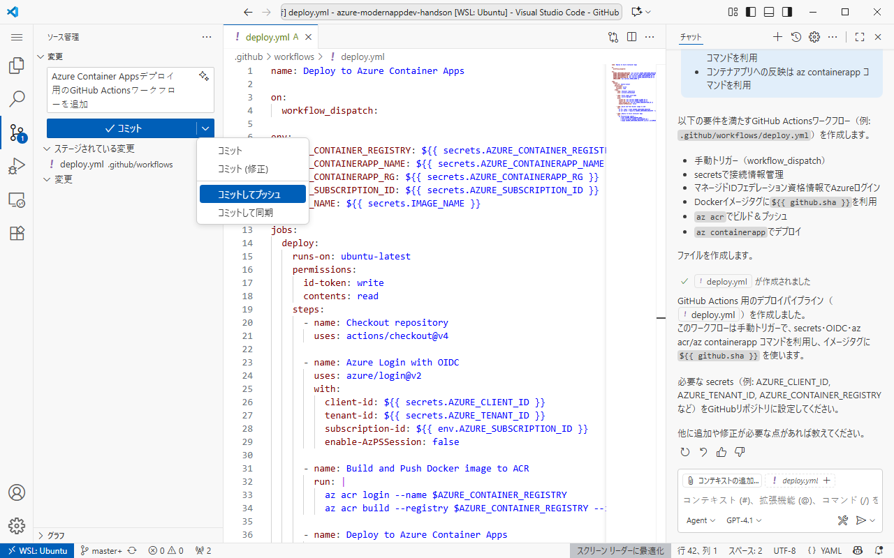
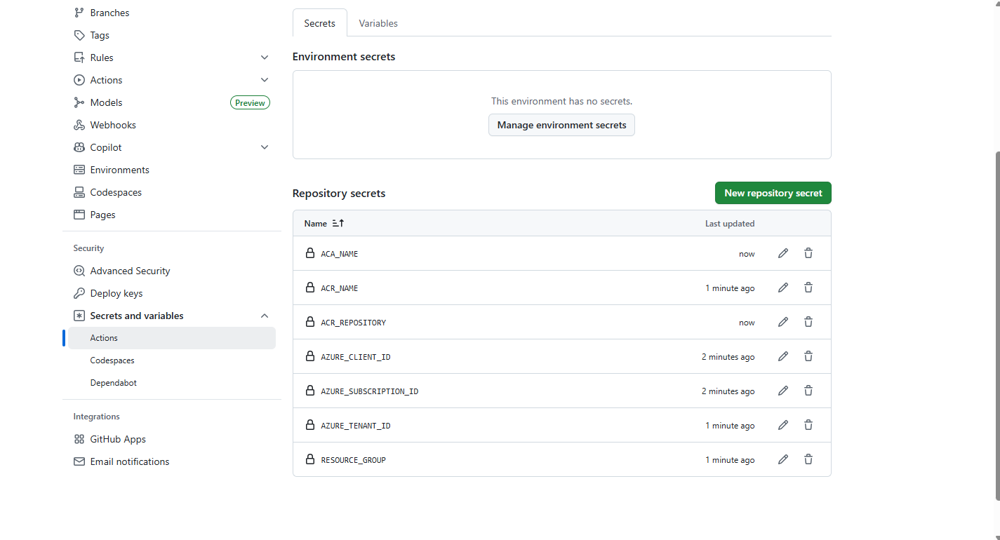
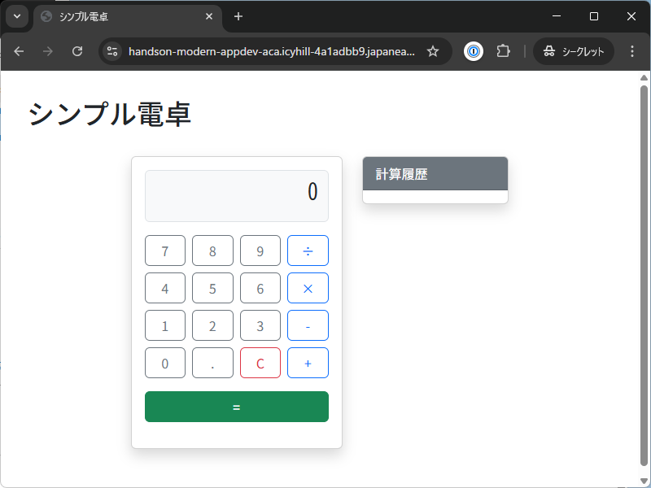

# Ex03: GitHub Actions を使った CI/CD パイプライン 作成

#### ⏳ 推定時間

- 10 ~ 15分

#### 💡 学習概要

ここまでに構築したインフラに対して作成したアプリケーションが自動的にデプロイされる仕組みを GitHub Actions を用いて実現していきます。
ここでも実際に実装を行うのではなく、GitHub Copilot に指示をすることでCI/CDパイプラインの構築を目指します。


#### 🗒️ 目次

1. [Git初期設定](#git初期設定)
1. [リポジトリ作成](#リポジトリ作成)
1. [CI/CDの実装](#cicd-の実装)
1. [GitHub -> Azure 接続設定](#github---azure-接続設定)
1. [GitHubリポジトリにシークレット登録](#github-リポジトリにシークレット登録)
1. [パイプラインの実行](#パイプラインの実行)
1. [動作確認](#動作確認)


## Git初期設定

1. PowerShell から WSL (Ubuntu) へログイン

    ```
    wsl ~
    ```

1. git 初期設定

    ```
    git config --global user.name "<GITHUB_ACCOUNT_NAME>"
    git config --global user.email "<GITHUB_ACCOUNT_EMAIL>"
    ```


## リポジトリ作成

> [!TIP]  
> 開発環境の Visual Studio Code を閉じていしまっていた場合、
> 次の手順で再度プロジェクトを開きます。
> まだ開いたままの場合はこの手順を飛ばして次のリポジトリ作成へ入ります。
> 
> 1. Visual Studio Code を起動
> 
> 1. 左下「リモートウィンドウを開く」を選択し、「WSLへの接続」を実行
> 
> 1. 今回のプロジェクトフォルダを開く

1. GitHubへコミットできるよう不要ファイルを除外

    ```
    #codebase
    Gitコミットするにあたり、不要ファイルの除外設定を追加
    ```
    
    

    内容確認して問題なければ「保持」します。

    > [!NOTE]  
    > `.gitignore` ファイルが追加され、 `node_modules` などが除外設定されていればOKです。

    

1. GitHubリポジトリを作成してプッシュするよう指示

    ```
    GitHubリポジトリを新規作成し、現在フォルダの内容をプッシュ

    作成時の考慮
    - ghコマンドが利用可能
    - ブランチ名は master
    - ログインから開始
    ```

    

    > [!NOTE]  
    > 基本的なリポジトリ作成の流れは以下のようになります。
    > うまくいかない場合、プロンプトで修正指示しながら進めます。
    > 
    > 1. GitHubへログイン
    > 
    >     ```
    >     gh auth login
    >     ```
    > 
    >    質問には以下のように回答
    > 
    >     - Where do you use GitHub? `GitHub.com`
    >     - What is your preferred protocol for Git operations on this host? `HTTPS`
    >     - Authenticate Git with your GitHub credentials? `Yes`
    >     - How would you like to authenticate GitHub CLI? `Login with a web browser`
    > 
    > 1. Git初期化
    >     
    >     ```
    >     git init -b master
    >     ```
    > 
    > 1. すべてのファイルをコミット
    > 
    >     ```
    >     git add .
    >     git commit -m "Initial commit"
    >     ```
    > 
    > 1. リポジトリ作成してプッシュ
    > 
    >     ```
    >     gh repo craete --source=. --public --push
    >     ```

1. GitHub.com を開いて、リポジトリが作成されたことを確認

    


## CI/CD の実装

1. GitHub Actions のワークフローを作成するよう指示

    ```
    GitHub Actions を使って、Azure Container Registry および Azure Container Apps を使った環境へデプロイするパイプラインを作成して

    実装時の考慮
    - 接続情報は secrets を利用
    - トリガーは手動のみ
    - AzureへのログインにはマネージドIDのフェデレーション資格情報を利用
    - Dockerイメージのタグには github.sha を利用
    - コンテナへのログイン、ビルド＆プッシュは az acr コマンドを利用
    - コンテナアプリへの反映は az containerapp コマンドを利用
    ```

    

    > [!NOTE]  
    > GitHub Actions のコードは長いため、処理順や処理方法など可能な限り具体化します。
    > 最終的に以下のようなコードが出力できればOKです。
    > 
    > ```yaml
    > name: Deploy to Azure Container Apps
    > 
    > on:
    >   workflow_dispatch:
    > 
    > permissions:
    >   id-token: write
    >   contents: read
    > 
    > jobs:
    >   build-and-deploy:
    >     runs-on: ubuntu-latest
    >     steps:
    >       - name: Checkout code
    >         uses: actions/checkout@v4
    > 
    >       - name: Log in to Azure
    >         uses: azure/login@v2
    >         with:
    >             client-id: ${{ secrets.AZURE_CLIENT_ID }}
    >             tenant-id: ${{ secrets.AZURE_TENANT_ID }}
    >             subscription-id: ${{ secrets.AZURE_SUBSCRIPTION_ID }}
    > 
    > 
    >       - name: Log in to Azure Container Registry (az)
    >         run: |
    >           az acr login --name ${{ secrets.ACR_LOGIN_SERVER }}
    > 
    >       - name: Build and push Docker image
    >         run: |
    >           az acr build \
    >             --registry ${{ secrets.ACR_LOGIN_SERVER }} \
    >             --image ${{ secrets.ACR_REPOSITORY }}:${{ github.sha }} \
    >             .
    > 
    >       - name: Deploy to Azure Container Apps
    >         uses: azure/CLI@v2
    >         with:
    >           inlineScript: |
    >             az containerapp update \
    >               --name ${{ secrets.ACA_NAME }} \
    >               --resource-group ${{ secrets.RESOURCE_GROUP }} \
    >               --image ${{ secrets.ACR_LOGIN_SERVER }}/${{ secrets.ACR_REPOSITORY }}:${{ github.sha }}
    > ```


1. [ソース管理] を開き、コメント生成

    

1. コミットしてプッシュ

    


## GitHub -> Azure 接続設定

マネージドID作成

1. Azureポータル 上部検索窓で 「マネージド ID」を検索、「マネージドID」を開く

    

1. 「作成」を選択

    

1. ユーザー割り当てマネージド ID の作成

    1. 基本

        - サブスクリプション: (ハンズオン用のもの)
        - リソースグループ名: (作成済みのもの)
        - 名前: (任意)

        

    1. タグ

        指定なし

    1. 確認と作成

        内容を確認して「作成」

        

マネージドIDに接続情報を作成

1. 作成した マネージドID を開く

1. [設定]-[フェデレーション資格情報] を開き、「資格情報の追加」を選択

    

1. フェデレーション資格情報の追加

    - フェデレーション資格情報のシナリオ: `Azureリソースをデプロイする GitHub Actions`
    
    GitHub アカウントを接続する
    - 組織: (GitHub.comのアカウント名)
    - リポジトリ: `azure-modernappdev-handson` (作成したリポジトリ名)
    - エンティティ: `ブランチ`
    - ブランチ: `master`

    資格情報の詳細
    - 名前: `handson-modern-appdev-gha-crt`(任意)

    

マネージドIDに権限付与

1. デプロイ予定のリソースグループ（最初に作成したリソースグループ）を開く

1. [アクセス制御(IAM)]を開き、「ロールの割り当ての追加」を選択

    

1. ロールの割り当ての追加

    1. ロール
        - 特権管理者ロール: `共同作成者(Contirbuter)`

        

    1. メンバー
        - アクセスの割り当て先: `マネージドID`
        - メンバー: (作成したマネージドID)

        

    1. 割り当てのタイプ
        - 割り当てのタイプ: `アクティブ` (デフォルト)
        - 割り当て機関: `Permanent`

        

    1. レビューと割り当て

        内容を確認して「レビューと割り当て」

        


## GitHub リポジトリにシークレット登録

1. GitHub.com で作成したリポジトリを開き、[Settings]タブへ移動

    

1. [Security] にある [Secrets and variables]-[Actions] を開き、「New repository secret」を選択してシークレットを追加

    

1. 「New repository secret」を選択し、GitHub Copilot に指示されたシークレットを登録

    > [!NOTE]  
    > 指示される変数名は状況によって異なります。
    > 前述のようなワークフローの場合、設定されるシークレットは以下のようになります。
    > 
    > | Name | Secret |
    > |---|---|
    > | `AZURE_CLIENT_ID` | 作成した "マネージドID" の [概要] にある 「クライアントID」|
    > | `AZURE_SUBSCRIPTION_ID` | 作成した "マネージドID" の [概要] にある 「サブスクリプションID」 |
    > | `AZURE_TENANT_ID` | "Entra ID" の [概要] にある 「テナントID」 |
    > | `RESOURCE_GROUP` | ACR や ACA をデプロイした 「リソースグループ名」 |
    > | `ACR_LOGIN_SERVER` | 作成した "Azure Container Registry" の [概要] にある「ログインサーバー」<br /> 生成されたコードによってはサーバー名ではなくリソース名の場合があるので注意。 |
    > | `ACR_REPOSITORY` | 作成した "Azure Container Registry" の [サービス]-[リポジトリ] にある「リポジトリ名」 |
    > | `ACA_NAME` | 作成した "Azure Container Apps" の 「リソース名」 |

    


## パイプラインの実行

1. GitHub.com で作成したリポジトリを開き、[Actions]タブへ移動

    

1. 作成したワークフローを開き、[Run workflow]-[Run workflow] を選択

    

1. 正常に完了したことを確認

    > [!NOTE]  
    > エラーが発生した場合、エラーメッセージをコピーして GitHub Copilot に質問します。
    > 解消方法が提示されるので、指示に従って修正します。
    > うまくいかない場合、 NOTE にある実際のコードを参考にしながら修正します。

    


## 動作確認

1. Azureポータルにて作成した Azure Container App を開き、[概要] にある 「アプリケーションURL」を取得

    

1. 新規ブラウザをシークレットモードで立ちあげて取得したURLを開く

    


